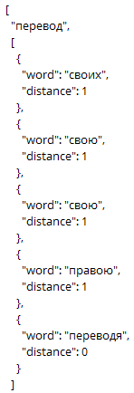

# Telegram Parser
Бот приложения Telegram для парсинга заданного боту текста
## Выбранная среда программирования
	Работа написанная  на платформе Nodejs
В ходе работы написан [бот](https://t.me/WebAnalyticsLab3_bot) получающий от пользователя на вход текст в котором хотим узнать упоминаются ли указанные [слова](https://github.com/Salkcid/WebAnalytics_lab_3/blob/master/index.js "строка 11") или схожие с ними:

	const signalWords = ['зритель','перевод','развертываться','дергать','наклонясь',];
	
Сначала выполняется проверка для искомого слова на полное совпадение. Если полных совпадений нету, то к слову и тексту применяется стемминг. Далее производится сравнение с учётом Levenshtein Distance, которое позволяет обнаружить слова которые схожие с искомым, но отличаются от него одной-двумя буквами.
В связи с использованием стемминга и Levenshtein Distance реализация допускает возможность ложных срабатываний. "distance" указывает расстояние Левенштейна для стеммы искомого слова и стеммы слова из текста.

## Пример работы бота
### Заданный текст:
	Граф танцевал хорошо и знал это, но его дама вовсе не умела и не хотела хорошо танцевать. Ее огромное тело стояло прямо, с опущенными вниз мощными руками (она передала ридикюль графине); только одно строгое, но красивое лицо ее танцевало. Что выражалось во всей круглой фигуре графа, у Марьи Дмитриевны выражалось лишь в более и более улыбающемся лице и вздергивающемся носе. Но зато, ежели граф, все более и более расходясь, пленял зрителей неожиданностью ловких вывертов и легких прыжков своих мягких ног, Марья Дмитриевна малейшим усердием при движении плеч или округлении рук в поворотах и притоптываньях производила не меньшее впечатление по заслуге, которую ценил всякий при ее тучности и всегдашней суровости. Пляска оживлялась все более и более. Визави не могли ни на минуту обратить на себя внимание и даже не старались о том. Все было занято графом и Марьею Дмитриевной. Наташа дергала за рукава и платье всех присутствовавших, которые и без того не спускали глаз с танцующих, и требовала, чтобы смотрели на папеньку. Граф в промежутках танца тяжело переводил дух, махал и кричал музыкантам, чтоб они играли скорее. Скорее, скорее и скорее, лише, лише и лише развертывался граф, то на цыпочках, то на каблуках носясь вокруг Марьи Дмитриевны, и, наконец, повернув свою даму к ее месту, сделал последнее па, подняв сзади кверху свою мягкую ногу, склонив вспотевшую голову с улыбающимся лицом и округло размахнув правою рукою среди грохота рукоплесканий и хохота, особенно Наташи. Оба танцора остановились, тяжело переводя дыхание и утираясь батистовыми платками.
### Ответ:
	[["зритель",
		[{"word": "зрителей","distance": 1}]],
	["перевод",
		[{"word": "своих","distance": 1},{"word": "свою","distance": 1},{"word": "свою","distance": 1},{"word": "правою","distance": 1},{"word":"переводя","distance": 0}]],
	["развертываться",
		[{"word": "развертывался","distance": 2}]],
	["дергать",
		[{"word": "дергала","distance": 1}]],
	["наклонясь",
		[{"word": "склонив","distance": 2}]]]
